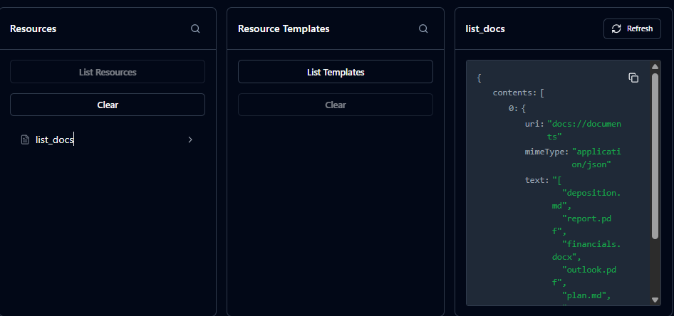
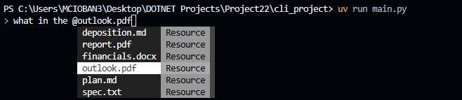
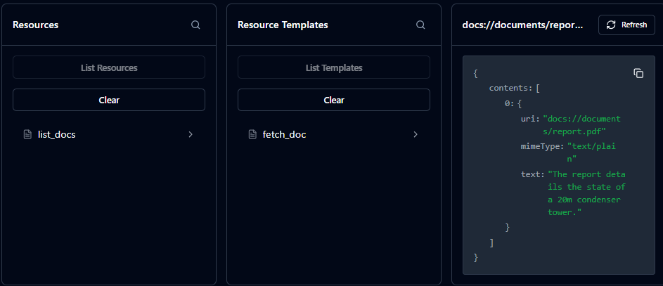
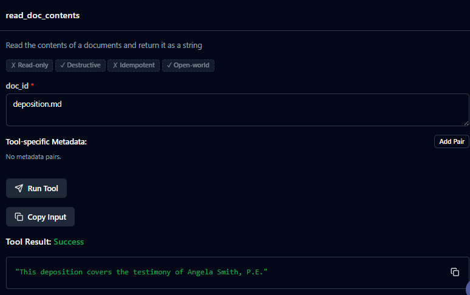
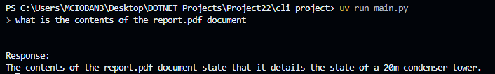
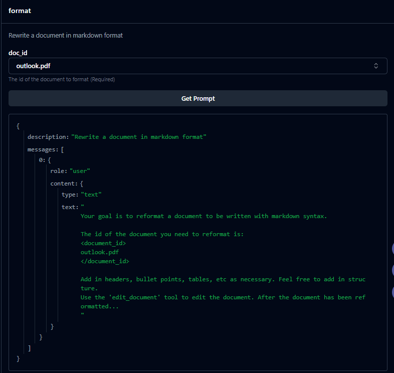
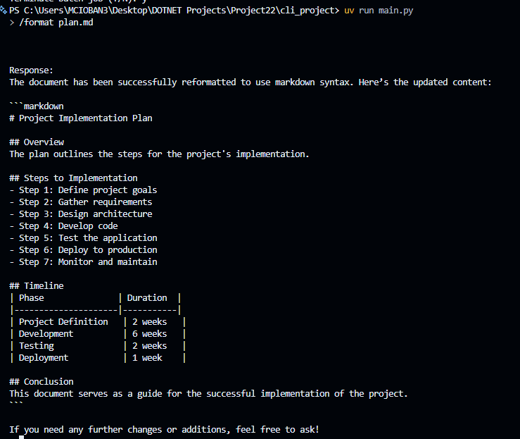
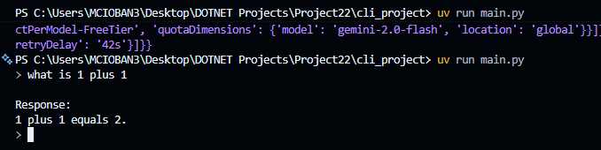

# MCP Server & Client using Azure OpenAI in Python

A command-line interface application that enables interactive AI-powered chat with full **MCP (Model Context Protocol)** support — backed by **Azure OpenAI**. It allows you to list resources, fetch documents, run prompt templates, and have natural language conversations, all from the terminal.

[](https://github.com/marius2347/MCPServerClient-using-MCP-Azure-OpenAI-in-Python)
[](https://www.python.org/)
[](https://modelcontextprotocol.io/)
[](https://azure.microsoft.com/en-us/products/ai-services/openai-service)

---

## Features

- **MCP Server & Client** — full bidirectional MCP communication over stdio
- **Azure OpenAI** integration for chat completions
- **Document retrieval** — fetch and read document contents via `@` mentions
- **Slash commands** — execute MCP prompt templates with `/command` syntax and Tab autocomplete
- **Resource listing** — browse all available MCP resources
- **Formatted document display** — pretty-print documents in the CLI

---

## Screenshots

### Listing Documents / Resources





### Fetching a Document



### Reading Document Contents





### Formatting a Document





### Prompt Example



---

## Prerequisites

- Python **3.10+**
- An **Azure OpenAI** resource with a deployed model
- Azure OpenAI API Key, Endpoint, and Deployment Name

---

## Setup

### Step 1: Configure environment variables

Create a `.env` file in the `cli_project` root directory with the following variables:

```env
AZURE_OPENAI_API_KEY=""        # Your Azure OpenAI API key
AZURE_OPENAI_ENDPOINT=""       # e.g. https://your-resource.openai.azure.com/
AZURE_OPENAI_DEPLOYMENT=""     # Your deployment name, e.g. gpt-4o
AZURE_OPENAI_API_VERSION=""    # e.g. 2024-02-01
```

### Step 2: Install dependencies

#### Option 1: Using `uv` (Recommended)

[uv](https://github.com/astral-sh/uv) is a fast Python package manager.

```bash
# Install uv
pip install uv

# Create and activate virtual environment
uv venv
.venv\Scripts\activate        # Windows
# source .venv/bin/activate   # macOS/Linux

# Install the project
uv pip install -e .

# Run
uv run main.py
```

#### Option 2: Standard pip

```bash
python -m venv .venv
.venv\Scripts\activate        # Windows
# source .venv/bin/activate   # macOS/Linux

pip install openai python-dotenv prompt-toolkit "mcp[cli]>=1.8.0"

python main.py
```

---

## Usage

### Basic Chat

Type any message and press **Enter** to chat with the Azure OpenAI model.

```
> What is the capital of France?
```

### Document Retrieval

Use the `@` symbol followed by a document ID to include its content in your query:

```
> Tell me about @deposition.md
```

### Slash Commands

Use `/` prefix to run prompt templates defined in the MCP server. Press **Tab** to autocomplete available commands:

```
> /summarize deposition.md
```

---

## Project Structure

```
cli_project/
├── main.py              # Entry point
├── mcp_server.py        # MCP server — exposes tools, resources, and prompts
├── mcp_client.py        # MCP client — connects to the server
├── pyproject.toml       # Project metadata and dependencies
├── core/
│   ├── chat.py          # Chat loop logic
│   ├── claude.py        # Azure OpenAI integration
│   ├── cli.py           # CLI entrypoint helpers
│   ├── cli_chat.py      # CLI-specific chat rendering
│   └── tools.py         # Tool call handling
└── .env                 # Environment variables (not committed)
```

---

## Development

### Adding New Documents

Edit `mcp_server.py` and add new entries to the `docs` dictionary to expose additional documents as MCP resources.

### Adding New Commands

Define new prompt templates inside `mcp_server.py` under the MCP `@server.prompt` section.

---

## Contact

**Marius** — [mariusc0023@gmail.com](mailto:mariusc0023@gmail.com)

GitHub: [https://github.com/marius2347/MCPServerClient-using-MCP-Azure-OpenAI-in-Python](https://github.com/marius2347/MCPServerClient-using-MCP-Azure-OpenAI-in-Python)

### Implementing MCP Features

To fully implement the MCP features:

1. Complete the TODOs in `mcp_server.py`
2. Implement the missing functionality in `mcp_client.py`

### Linting and Typing Check

There are no lint or type checks implemented.
